# Improving the Interoperability of Data Using REST 

Yan Liu (GitHub alias: zxyanliu), a Computer Science master's graduate from University of Washington, yl2017@uw.edu

Currently working with Microsoft as a technical writer. 

## Abstract
Abstract—With the growing number of businesses, the size and magnitude of data generated, consumed and stored in different parts of an organization continues to increase rapidly. Sharing this data with other businesses and integrating it for further analysis and into the decision making process provide great benefits from a business perspective. Conventional approaches of exposing and consuming data through databases across multiple platforms can be risky and complex, involving significant coding and formatting. A major challenge for businesses is then to determine how to expose and share data residing in different databases to consumers with minimal effort while maximizing controllability and security. Open Data Protocol (OData) has been a popular solution to this problem. OData offers a uniform way to describe the data and data model for easy interoperability between data sources and applications, services and clients. However, creating OData services is tedious, time-consuming, and involves much complexity. OData is also criticized for lack of clear abstraction between services and underlying data. In this paper, we proposed a middleware based on RESTful API for interoperability and ease of use of data residing in different SQL Server databases. This middleware will act as a layer between the databases and the users, facilitating the consumers to use databases in diverse platforms and increasing their interoperability across organizations. 

**Keywords**—Database, SQL Server, OData, RESTful API, Interoperability. 

## 1. Introduction 
_1.1 Background_ 

In this era of Big Data, integrating data from different sources for analysis and decision-making is of great value to enterprises. Unfortunately, many of the existing conventional approaches of integrating data are complex, involving significant coding and formatting, especially for data residing in different databases and on multiple platforms. This makes the data sharing tightly coupled to the DBMS and the applications attempting to access it. As the demand for sharing and analyzing data for possible integration across businesses, it becomes inevitable that these conventional approaches require significant human involvement (e.g. database administrators) as well as maintenance. 

To solve the above-mentioned challenges and more, the idea of this project originates from the concept of a RESTful API, which is also referred to as a RESTful web service. It is based on Representational State Transfer (REST) [1][2] architecture that uses HTTP requests to mimic the Create, Read, Update and Delete (CRUD) operations of the data. 

_1.2 Related Work_

The concept of “RESTify data” means to expose data as RESTful services for data access and interoperability. It is becoming an active topic of research that has attracted researchers and businesses over the past few years. Through this process, data becomes less independent on the core application framework and provides more accessibility to clients. It is also a concept of Database-as-a-Service (DaaS), the scope of which has extended from traditional relational models to new approaches such as the more lenient key-value stores [12]. 

Early works of database interoperability focused on developing system architecture to integrate heterogeneous database systems and meanwhile maintaining their autonomy [7][13]. Most work in recent years are dedicated to service-oriented software architectures and resource consumption models [3][4][6][8][10][12]. However, little research articles have yet been published about the development and implementation of generic tools for the improvement of data interoperability and ease of use across different platforms. 

With the increasing demand in data exposure and consumption, one of the most popular approach to expose and consume database is through APIs. Data providers build independent APIs with certain technology, and data users consume data through their exposed APIs. This process usually involves much complexity since those exposed APIs are built on different technology and with different protocols. 

To standardize and uniform the protocols, Microsoft initiated and invented Open Data Protocol (OData) in 2006. It is a protocol to facilitate the publication and consumption of queryable and interoperable data-driven online services [9]. OData was standardized by OASIS in 2014, with a joint effort from companies such as Microsoft, IBM, and SAP. Built on technologies such as HTTP, ATOM/XML and JSON, OData provides the flexibility needed for accessing and consuming databases when compared to other REST-based web services. OData offers a uniform way to describe the data and the data model for easy interoperability between data sources and applications, services and clients. Consumers of OData master one API and use it to consume multiple data sources. OData defines the best practice for building and consuming RESTful APIs.  For its popular implementation in industry OData has become a hot topic in research work [8][10].  

However, while consuming an OData service is easy, the task of creating OData services is tedious, time-consuming, and involves much complexity, and extra effort is needed for relational databases for query capabilities [8]. To create an OData service, data providers need to do the following: first represent their data models in OData format; then implement the business logic to transform OData requests to SQL statements (or the target storage technology of choice); and finally, de/serialize the exchanged messages confirming to the OData protocol [8]. OData has also been criticized for lack of clear abstraction between services and underlying data. In Ben Morris’ paper (2013) “Netflix has abandoned OData – does the standard have a future without an ecosystem?”, he pointed out the problem of tightly coupling of public service definition to the underlying database system in Entity Framework in .Net. 

_1.3 Research Questions_
   
Based on the analysis of the increasing demand of data sharing and consumption and the status quo of related work in this field, this research project investigates two primary research questions: 

1.	How to enhance the interoperability and ease of use for sharing data resides across one or more databases? 
2.	Can we use existing protocols that have proven to be successful (i.e. HyperText Transfer Protocol – HTTP) for turning existing database items into accessible Uniform Resource Identifiers (URIs)?

In this project, we developed a middleware that could be used to solve the above-mentioned challenges. In this middleware, a RESTful API-based solution is incorporated to expose data residing in different databases using URIs that can be accessed via the web. This increases the interoperability of using data across different databases as well as the productivity when dealing with multiple, distributed databases simultaneously. 

_1.4 Contribution_

Driven by above-mentioned motivations, this project focuses primarily on three main contributions: 

* Design and apply a middleware based on RESTful API for facilitating access to given databases with supporting the CRUD operations.
* Conduct and document a literature review of the research work in data sharing and integration.
* Increase the level of understanding of how the database, service-oriented and APIs can work together for the establishment of exposing databases through a RESTful API so as to enable clients to articulate the basic SQL-like queries including INSERT INTO, UPDATE, DELETE and SELECT. 

This middleware will serve as a layer that can be added into the database design in which clients access this RESTful API to communicate with the databases, rather than connecting directly to the DBMS. 

## 2. Methodology
_2.1 Why REST not SOAP?_ 

Both Simple Object Access Protocol (SOAP) and The Representational State Transfer (REST) are architecture styles using HTTP as a transport protocol. In the world of web services, SOAP has gained much dominance and acknowledgement. However, one limitation of SOAP is that it lacks true characteristics of accessing resources using web URIs that HTTP possesses [9]. 

The Representational State Transfer (REST) architecture was first introduced by Roy Fielding in his Ph.D. dissertation entitled “Architectural Styles and the Design of Network-based Software Architectures” [1][ 2]. REST is defined by means of the consumption of resources, which are exchanged between client and server through a given protocol [4]. It is an architectural style first proposed to simplify distributed operations over the World Wide Web in conjunction with the semantics of the HTTP protocol [9]. 

Applications that implements the concepts and paradigms established by REST is called being RESTful [5]. In the world of REST, developers focus on “what” is being transmitted (resource) and rather than “How” it is being transmitted. It is also noted that although REST is well suited for HTTP, the architectural concepts are not limited to HTTP alone [9]. This style of access to data supports a variety of formats such as JavaScript Object Notation (JSON) and Extensible Markup Language (XML), which could be easily integrated to applications. In general, REST architecture has the following advantages: 1) allow interactions between clients and servers in a loosely coupled way; 2) allow systems to be deployed as independently accessible resources; 3) allow all resources accessible using an addressable URI [9].  

Moreover, to address our research questions mentioned in 1.3, there are two major reasons why we designed and implemented our middleware using REST. Firstly, REST adopts protocols such as HTTP to ensure the standardization required to provide interoperability between systems. These protocols allow implementation of the communication methods (POST, PUT, DELETE, and GET) between client and server [3]. Secondly, in REST applications each resource is identified by a URI (Uniform Resource Identifier). By turning database items into accessible URIs, which in the scope of the WEB will have an identifier represented by a URL (Uniform Resource Locator) corresponding to a unique IP address [3]. By turning the database items into accessible URIs, we RESTify the databases and turn database into service. 

Finally, with REST technology, it is possible to integrate the querying of databases via REST APIs. Hence, our solution to the research problem can be addressed through building a web service to mimic SQL that easily allows us to control the database without much coding. We also take advantage of the built-in HTTP commands like GET, POST, PUT and DELETE to fit for Create, Read, Update and Delete operations on data.  

_2.2 System Design Architecture_

We designed and built our middleware based on RESTful API to foster simplicity, usability and interoperability of data residing in different databases, and we coined a name for this middleware as “RESTify DB”. This middleware is designed and implemented to facilitate the use of data from different databases and has the following characteristics: 1) act as a layer between user and databases for data access; 2) support transparency and hide all implementation details; 3) mimic SQL statements and conduct the CRUD operations; 4) turn existing database items into accessible URIs. The system is designed and implemented with the ASP.NET and ADO.NET technology and the system architecture is shown in Figure 1: System architecture of RESTify DB. 

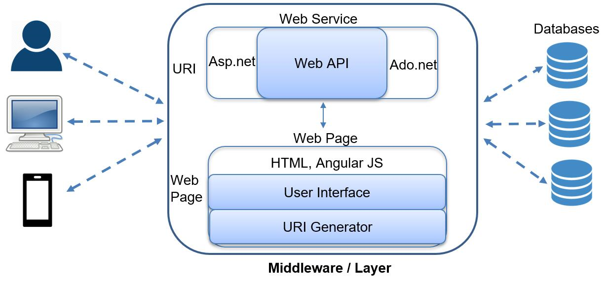

This system architecture consists of three tiers: client, server, and DBMS. What we focus in this project are the second and third tiers, i.e., our proposed framework that runs on a web server with the REST API lies on the second tier of REST Middleware, and the database that is running on a DBMS is the third tier. Client (tier 1) communicates with database (tier 3) via REST API (tier 2). The REST Middleware is further divided into four parts: User Interface where customers create their requests, Query engine where customer requests are authenticated, connection module where communication is realized via REST API, and optimizer to communicate with database for a return of results. When the request is successfully fulfilled, it returns from DBMS to server and finally to client. For the customer, the REST Middleware is transparent that customers will feel like getting the resource directly from a database.

This middleware is built on the basic assumption that, with this created RESTful API, the selected existing database is accessible and can be manipulated using the CRUD operations which are mapped to the HTTP protocol. The middleware hides implementation details, and users may feel like manipulating the database directly. 

_2.3 Key Technologies for Implementation_

We used ASP.NET technology to build the REST API for HTTP communication. The implementation detail and URI design are shown in Figure 2: REST API implementation with ASP.NET. 

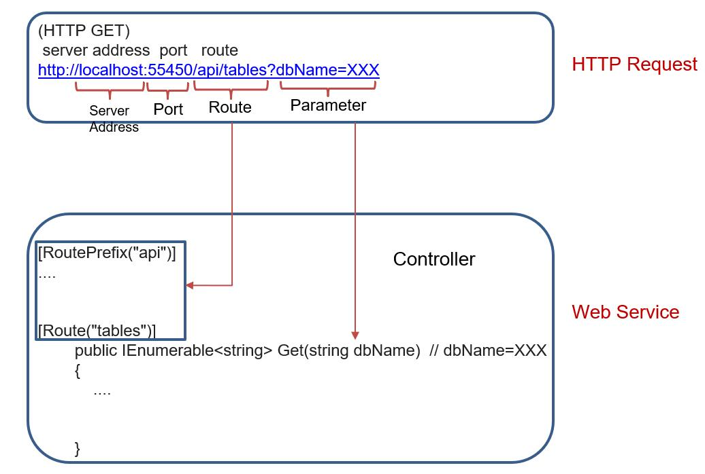

To use this service, the request process consists of encoding a URL [3], and it follows the following format: 

`http://<server address>: <port>/<route>?<parameters>`. 

* `<server address>`: service application address 
* `<port>`: communication port where the service is running
* `<route>`: unique route that is used to provide access to a specific method 
* `<parameters>`: represent the variables of the request

For example, if we want to access database MyDB01, table PRODUCTS, query and retrieve products whose prices are 79.99. In our design, we have the following URL: 

`http://localhost:55450/api/items?tableName=PRODUCTS&parameterName=price&parameterValue=79.99&dbName=MyDB01`

We applied ADO.NET technology in .NET Framework to connect our web API with the database. ADO.NET is powerful data access technology using the connections pooling and disconnected datasets technique, which foster improved performance and scalability. There are two major methods in the ADO.NET connection pooling technique: `SqlDataReader` and `SqlDataAdapter`. With `SqlDataReader`, it is faster to get result, but it returns one record in memory at a time rather than the entire dataset and consumes more connection resource; with `SqlDataAdapter`, the connection is closed as soon as it’s done loading data and result is returned as a set. We used `SqlDataAdapter` at this time for building our middleware to save connection resource. 

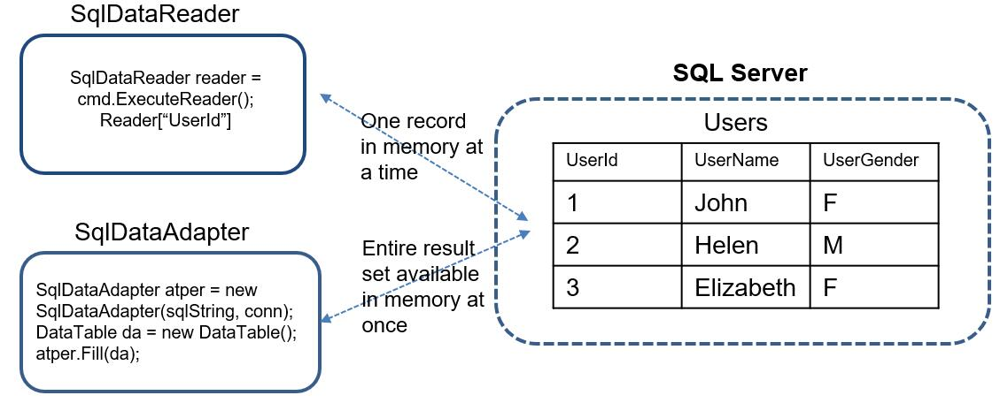

Then, in the Web API design, controllers are used to control URI path and target functions. In ADO.NET, connection string is used for data connection. The Web API and ADO.NET are connected by business logic. 

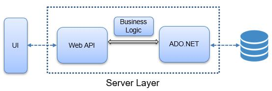

Finally, we used Angular JS to build and maintain the front-end User Interface. With Angular JS, the values of HTML and JavaScript are bound together. The data is read into the background through JavaScript and displayed on the HTML page in real time. 

## 3. Experiment and results 

There are altogether four major steps in doing the experiment: 1) We build and download SQL Server databases. 2) We build the REST API using ASP.NET and connect the service with databases with ADO.NET technology. This step is done in Visual Studio where we code in C#. 3) We build front-end User Interface with Angular JS framework for data binding of HTML and JavaScript. For this step, we primarily code in JavaScript. 4) We test and evaluate the system. 

_3.1 Experiment_

The detailed implementation of the experiment is elaborated in the following part with three components. 

The first component is the database. We built databases on SQL Server with SQL statements and downloaded two more sample databases **Northwind** and pubs provided by Microsoft [14].  

The second component is a RESTful API implemented with ASP.NET technology. With server address, port, route and parameter, we can make an HTTP request, which is connected to the controller of the web service part. 

RESTful API makes use of the ADO.NET technology for connection with the database and enable clients or end users to execute SQL-like commands transformed by the CRUD operations in HTTP. This way, HTTP is used to mimic the operations of SQL commands such as SELECT, INSERT INTO, UPDATE and DELETE. In the RESTful architecture, each URL represents a resource, so there is no verb in the URL, only nouns, and the terminology used usually corresponds to the database table name. 

The third component is front-end User Interface built with Angular JS framework. With Angular JS, data is read into the background through JavaScript and displayed on the HTML page in real time. The built User Interface is shown in Figure5: Execute SQL-like Query on UI and Response. In this User Interface, the user can interact with the database directly by making the CRUD operations through SQL-like queries. 

_3.2 Evaluation_

There is limited study that focus on the evaluation of a specific REST web service like RESTifyDB. I only found two papers with special focus on the evaluation. In one paper, a web service Restify (http://restify.com/) is evaluated by comparison of its latency and performance through a retrieval simulation of a set of data is used [3]. In another, different aspects of automated testing of RESTful APIs are described and a model-based software development is applied [6]. 

_3.3 Results_

In this part, we provide three scenarios to test the system. Our goal is to show: 1) this middleware is capable of querying data from different databases with ease; 2) this middleware supports the CRUD operations (e.g., the read and delete functions shown in this paper). 

When a database is selected, and its path provided, the API will authenticate with the database management system (DBMS) running the database and establishes a connection. Once a connection is established, the REST API will then convert any user generated requests into HTTP verbs. Once the server receives these requests, they will be then transformed into SQL statements that will be executed on a DBMS. Once the results generated by the DBMS are completed, they will be sent back to the client or user. The REST API will also make the data accessible in a resource-like structure.

* Scenario 1: We want to access data from sample database **Northwind**, e.g., from table Customers, query and retrieve customers who live in the city of Berlin. 

In our design, we have two ways to access the data, one is via the User Interface, and another is with a specific URI in browser. 

By interacting with the User Interface, we choose the sample database **Northwind**, table name Customers, and select the customer where city = Berlin. By clicking the “submit” button, we get corresponding results, which is shown in Figure5: Execute SQL-like query on UI and response. 

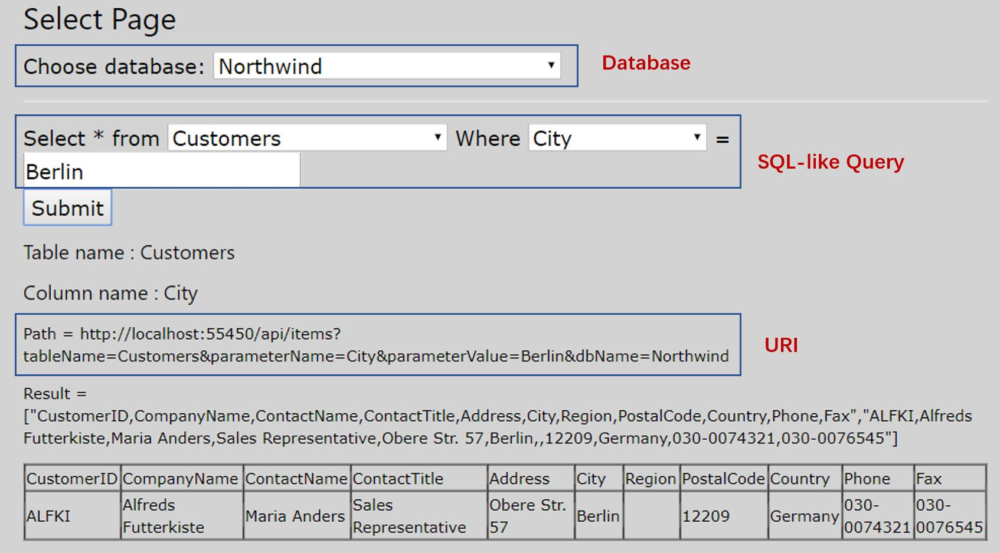

Now, let’s try access the database with our designed URI. Based on what is explained concerning the URI design in 2.3 Key Technologies for Implementation, this query has the following URI:  

`http://localhost:55450/api/items?tableName=Customers&parameterName=city&parameterValue=Berlin&dbName=Northwind `

This URI is also generated automatically in the previous User Interface. Using this URI in the browser, we get response in XML or JSON, which can be used for data exchange and integration on the web. 

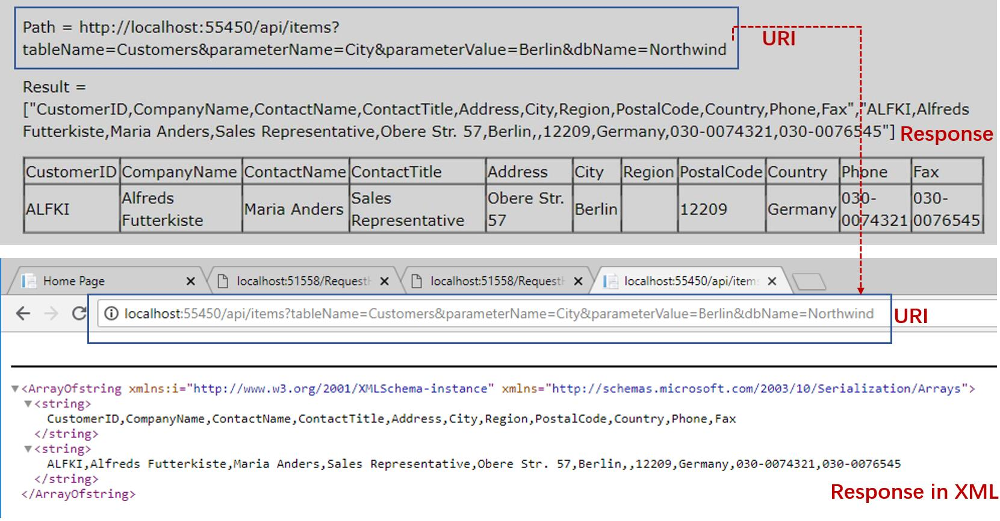

For the first scenario, we finally check the retrieved results with results from execution of SQL statement in the database, and we get consistent results, which is shown in Figure 7 Execute SQL Query on DB and Response. 

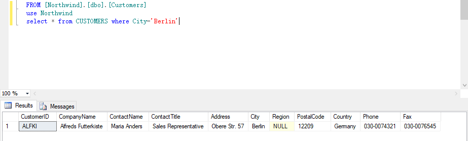

* Scenario 2: We want to show querying data from another database via this system with ease in this system. We select from database MyDB02 and from table Suppliers where user name is “Acer”. This query can also be made using our designed URI. 

`http://localhost:55450/api/items?tableName=SUPPLIERS&parameterName=sup_name&parameterValue=Acer&dbName= MyDB02`

The result of this request is shown in Figure 8: Query data from a different database and response. The results show that we can query data from different databases using this system. 

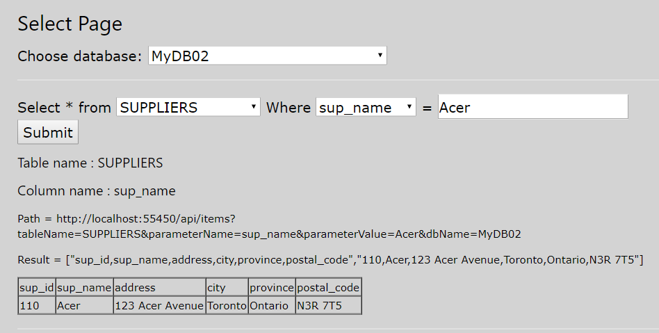

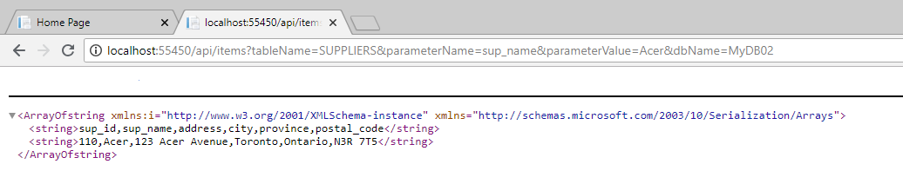

* Scenario 3: Now we show deletion of this item “Acer” in two ways, one via User Interface, another via URI. The URI format for deletion is as follows: 

`http://localhost:55450/api/delete?tableName=Suppliers&parameterName=sup_name&parameterValue=Acer&dbName= MyDB02`

Results of the deletion methods are shown as follows:

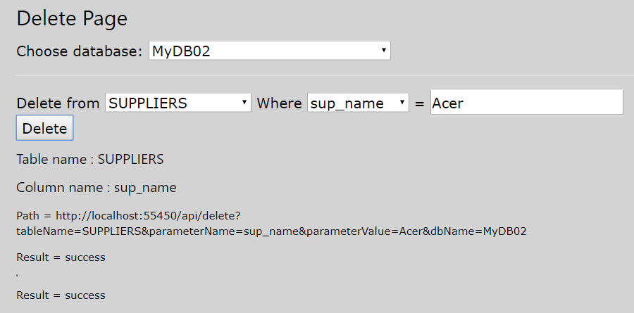
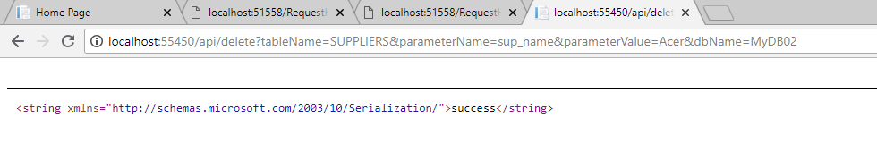

## 4. Conclusion

In this project, we built a middleware based on RESTful API, which serves as a layer support transparency between users and databases for simple manipulation of one database and across different databases. This layer hides implementation details and users may feel like manipulating the database directly from the User Interface or through our designed URI. The layer supports the HTTP CRUD operations on SQL Server databases, thus facilitating the use of data from different databases and increase their interoperability.  

There many challenges in completing this project, and the biggest challenge is learning so much knowledge and implementing a working platform with new technology in such limited time. In the phase of system design, we were confronted with the challenge of creating our own architecture with limited research articles available for reference. The project was also in the middle of dilemma when we found it is hard to implement the system using existing OData architecture as originally designed because of its complexity and its problem of tight coupling between the service and underlying databases. Moreover, there are challenges when we used our design architecture to implement the CRUD operations, each of which we later defined independently in the functions rather than integrating into one. 

In the future, we would like to design and implement a registration system upon this middleware, allowing data consumers and providers to register on the platform (i.e. a SOA-based model). We would also like to continue exploration work on how to build a web service on top of the existing OData-based REST API, which supports most SQL queries and different types of databases, including MySQL, Oracle, DB2, SQLite, etc. 

## References

> ![Note]
> Most references are in English, except [4] which is in Portuguese. Google translate is used for reading and understanding this paper. 

- [1]	Fielding, Roy Thomas. "Chapter 5: Representational State Transfer (REST)". Architectural Styles and the Design of Network-based Software Architectures (Ph.D. dissertation). University of California, Irvine, 2000.   
- [2]	Fielding, Roy Thomas. “Chapter 2: Network-based Application Architectures”. Architectural Styles and the Design of Network-based Software Architectures (Ph.D. dissertation). University of California, Irvine, 2000. 
- [3]	Luiz F. Marques , Ronaldo C. M. Correia, et al. Databases Available Through APIs Using Resfity: Characteristics, Programming Models, and Benchmarks.  IEEE Xplore, Lisbon, Portugal, 2017. 
- [4]	Safaripour, Razieh, et al. “A restfull architecture for enabling rapid development and deployment of companion robot applications.” Computing, Networking and Communications (ICNC), International Conference on. IEEE, 2014. 
- [5]	Richardson, Leonard, and Sam Ruby. RESTful web services. O'Reilly Media, Inc., 2008. 
- [6]	Tobias Fertig and Peter Braun, Model-driven Testing of RESTful APIs. WWW’15 Companion: Proceedings of the 24th International Conference on World Wide Web. ACM, 2015. 
- [7]	Christine Parent and Stefano Spaccapietra, “Chapter 9 Database Integration: The Key to Data Interoperability”. Advanced in Object-Oriented Data Modeling. M. Papazoglou; S. Spaccapietra; Zahir Tari; Cambridge, Mass. : MIT Press, 2000. 
- [8]	Hamza Ed-douibi, Javier Luis C´anovas Izquierdo, Jordi Cabot. Model-driven Development of OData Services: An Application to Relatrional Databases. IEEE Xplore, 2018. 
- [9]	Sandeep Chanda, Damien Foggon. “Chapter 9: Consuming Data Using WCF Data Services”, Beginning ASP.NET 4.5 Databases, pp 157-175. Apress, Berkley, CA. Springer, 2013. 
- [10]	H. Ed-Douibi, J. L. C´anovas Izquierdo, and J. Cabot, “A UML profile for OData APIs,” in International Confonference on Web Engineering, Springer, 2017.
- [11]	Jakob Strauch and Silvia Schreier. RESTify: from RPCs to RESTful HTTP design. WS-REST '12 Proceedings of the Third International Workshop on RESTful Design, Pages 11-18. ACM, 2012. 
- [12]	Till Haselmann, Gunnar Thies, and Gottfried Vossen. Look into a Universal REST-based API for Database-as-a-Service Systems. IEEE, 2011. 
- [13]	A. Zisman and J.Kramer, Towards Interoperability in Heterogeneous Database Systems. Imperial College Research Report No. DOC 95/11, 1995. 
- [14]	Northwind sample database: 
https://technet.microsoft.com/en-us/bb399411(v=vs.91) 

